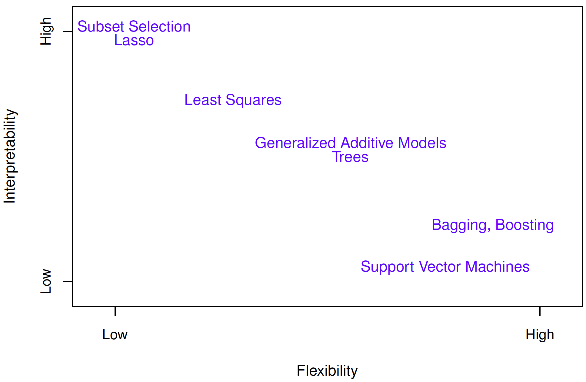
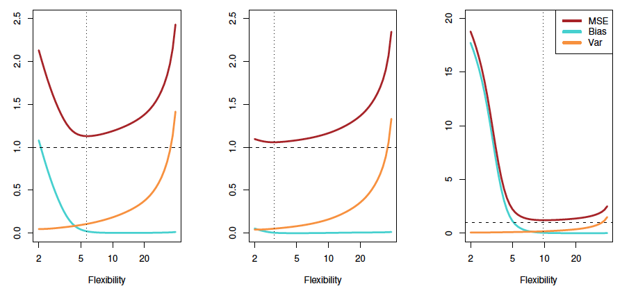

## What is statistical learning?
Statistical learning deals with the problem of finding a predictive function $f$ based on data.  

### Supervised learning
Involves building a statistical model for predicting or estimating an output based on one or more inputs.

### Unsupervised learning
Observes input variables with no corresponding supervising output. This is used to learn relationships and structures from data.

## Types of statistical problems
### Regression problem
If the goal involves predicting a continuous or quantitative output then this is often referred to as a regression problem.

### Classification problem
If the goal is to predict a qualitative response (for example, whether the sales is going to go up or down) then this is referred to as a classification problem.

### Clustering problem
Understand about inputs and group similar inputs according to their characteristics known as clustering problem.

## Variables
### Input variable 
In supervised learning, input variables are used to predict or estimate an output. The input variables are also called predictors, independent variables (plot on x-axis), features or called just variables. The input variables are denoted by $X_{1}, X_{2}$ and so on.

### Output variable 
The output variables is called response or dependent variable (plot on y-axis) and it is denoted by $Y$.

## Relationship between input and output variables 
Suppose we observe a quantitative response $Y$ and inputs $X_1$, $X_2$,...,$X_p$. The general relationship between an output and input can be written using the following equation: $$Y = f(x)+\epsilon$$ where $f(x)$ is fixed but unknown function and $\epsilon$ is a random error term which is independent of X and has mean zero.

### Prediction 
$f(X)$ or function on X is used to estimate prediction and inference. When predicting response $Y$, lets assume that the error term averages to zero, the response can be calculated as: $$\hat{Y} = \hat{f}(X)$$
where $\hat{f}$ represents estimated f and $\hat{Y}$ represents the prediction for $Y$.
The accuracy of prediction $\hat{Y}$ for $Y$ depends upon two quantities: _reducible error_ and _irreducible error_. The reducible error can be improved by using the most appropriate statistical learning technique to estimate $f$. Even if the reducible error is zero, the estimated response $\hat{Y}$ contains irreducible error which cannot be improved by any statistical learning technique. Irreducible error will always provide an upper bound on the accuracy of our prediction for Y and in practice this bound is almost always unknown.

__Where irreducible error comes from?__  
The irreducible error may contain unmeasured variables which are useful in predicting $Y$. The irreducible error may contain unmeasurable variation. For example, the risk for an adverse reaction might vary for a given patient on a given day, depending on manufacturing variation in the drug itself or the patient's general feeling of well-being on that day.
Assume that both $\hat f$ and $X$ are fixed, the prediction equation $\hat Y=\hat f(X)$ can be written as:
$$E(Y-\hat Y)^2 = E[f(X) + \epsilon - \hat f(X)]^2$$
$$E(Y-\hat Y)^2 = [f(X) - \hat f(X)]^2 + Var(\epsilon)$$
where $[f(X) - \hat f(X)]^2$ is _reducible error_ and $Var(\epsilon)$ is _irreducible error_

### Inference 
Sometimes our goal is to understand the relationship between predictors and response as oppose to predicting the outcome. For example; which predictors are associated with the response, what is the relationship between the response and each predictor, what kind of relationship exists between response and each predictor (linear or non-linear), etc.

## How do we estimate $f(X)$? 
Before we jump in estimating $f(X)$, there are few terms (training dataset and test dataset) which are essential to know. Lets assume that we observed n = 30 data points. Our goal is to apply statistical learning method to the training data in order to estimate the unknown function $f$. In other words we want to find a function $\hat f$ such that $Y \approx \hat f(X)$. Most statistical learning methods can be characterized as either _parametric_ or _non-parametric_.

### Parametric methods 
There are two steps involved.  
1. Make a simple assumption is that $f$ is linear. $$f(X)=\beta_0+\beta_1X_1+\beta_2X_2+...+\beta_pX_p$$
2. After a model is selected, we need to estimate the parameters of linear equation and apply to fit the model. The most common approach to fit the model is called _(ordinary) least squares_. There are other ways to fit the model.

_Advantages_  
Reduces the problem of estimating $f$ and it is generally much easier to estimate $\beta_0+\beta_1+\beta_2+...+\beta_p$ as compared to finding an arbitrary function $f$.

_Disadvantages_  
Linear model may not necessarily fit the true unknown form of $f$. There is a possibility that the chosen model is far from the true $f$, hence our estimate will be poor. There are other flexible models available which can be used to get close to the unknown for of $f$. However fitting flexible model comes with cost of using large number of parameters and hence the model becomes sensitive to any errors or noise in the dataset. This phenomenon is called _overfitting_ the data.

### Non-parametric methods 
Non-parametric methods do not make assumptions about the functional form of $f$. Instead they seek an estimate of $f$ that gets as close to the data points as possible without being too rought or wiggly.

_Advantages_  
More accurate estimation of $f$ as compared to parametric methods.

_Disadvantages_  
Major disadvantage is that a very large number of observations is required in order to obtain an accurate estimate for $f$.

## Accuracy and model interpretability
Based on the figure shown below, the flexibility and interpretability of model can be both high and low. The question is why high flexibility model is preferred over low flexibility and why high interpretability over low interpretability. The answer is based on an user interest. For example, if an user is interested in inference then less flexible models are easy to interpret. For example, in linear model it is easy to interpret the relationship between $Y$ and $X_1$,$X_2$,...,$X_p$. However on the other hand, if accurate prediction is required and model interpretability is less of a concern then highly flexible model might give better results. However highly flexible model comes with a price of _overfitting_ which is a major drawback in highly flexible statistical models.

## Accessing model accuracy
There is no single statistical learning method which fits for all data sets. Selecting the best approach can be one of the most challenging parts of performing statistical learning in practise.

### Measuring the quality of fit 
In order to evaluate the performance of a statistical learning method on a given data set, we need to measure how well the prediction actually match the observed data. In regression setting, the most commonly-used measure is the _mean squared error_ (MSE) which is given by $$ MSE=\frac{1}{n}\sum_{i=1}^n(y_i- \hat f(x_i))^2 $$
where $\hat f(x_i)$ is the prediction that $\hat f$ gives for the $i$th observation. The smaller MSE means better statistical method fit. The MSE is calculated from the above equation on the training data and hence it is called training MSE. The main goal is to get lower MSE for the test data set. The training data set could be something seen but test data set is completely unseen and we dont know how well our model predicts on the test data set. Suppose that we have clinical measurements (e.g. weight, blood pressure, height, age, family history of disease) for a number of patients, as well as information about whether each patient has diabetes. We can use these patients to train a statistical learning method to predict risk of diabetes based on clinical measurements. In practice, we want this method to accurately predict diabetes risk for future patients based on their clinical measurements. We are not very interested in whether or not the method accurately predicts diabetes risk for patients used to train the model, since we already know which of those patients have diabetes.  

In some cases test data set is available which were not used to train statistical method. However when test data set is not available then training data set can be used to evaluate training MSE. Since training data set is closely related to test data set, logically lower MSE for the training data set of the chosen statistical method will give lower MSE for the test data set; however this representation is not always true and in some cases test MSE would be higher than train MSE. This is further discussed using the figure shown below.

As shown in the figure (left hand), it is evident that flexible model tends to fit better than restrictive model (linear regression) however how good the fit is cannot be seen. Looking into right hand side of the figure, the flexible model (gray color) gives lower training MSE but such pattern does not reflect on the test data set (red color). The mid flexible model (blue line) out performs better than rest of the models. In the right-hand panel of Figure, as the flexibility of the statistical learning method increases, we observe a monotone decrease in the training MSE and a U-shape in the test MSE. This is a fundamental property of statistical learning that holds regardless of the particular data set at hand and regardless of the statistical method being used. As model flexibility
increases, training MSE will decrease, but the test MSE may not. When a given method yields a small training MSE but a large test MSE, we are said to be overfitting the data. This happens because our statistical learning procedure is working too hard to find patterns in the training data, and may be picking up some patterns that are just caused by random chance rather than by true properties of the unknown function f. When we overfit the training data, the test MSE will be very large because the supposed patterns that the method found in the training data simply don’t exist in the test data. Note that regardless of whether or not overfitting has occurred, we almost always expect the training MSE to be smaller than the test MSE because most statistical learning methods either directly or
indirectly seek to minimize the training MSE. Overfitting refers specifically to the case in which a less flexible model would have yielded a smaller test MSE.

### Bias and variance tradeoff  
The U-shaped observed in the test MSE is not just random. This is a result of two competing properties _variance_ and _bias_. The _expected test MSE_ can be written as $$E\Big( y_0-\hat f(x_0)\Big)^2 = Var\Big(\hat f(x_0)\Big) + \Big[Bias\Big(\hat f(x_0)\Big)\Big]^2 + Var(\epsilon)$$
Here the notation $Var\Big(\hat f(x_0)\Big)$ refers to variance and $\Big[Bias\Big(\hat f(x_0)\Big)\Big]^2$ refers to bias. The above equation shows that in order to minimize the expected test error rate, we need to find a statistical method which gives low variance and bias. Variance and bias are non-negative numbers and expected test MSE can never go down below $Var(\epsilon)$.  

What is _Variance_?  
_Variance_ refers to the amount by which estimated $\hat f$ would change if we estimated it using a different training data set. Ideally estimated $\hat f$ should not change significantly between different training data sets. If it does, this mean that the statistical method has high variance. Generally flexible statistical methods have higher variance. What it means that if there is a slight change in training data sets, the estimated $\hat f$ will change significantly. Based on the above figure; the flexible green curve is following the observations very closely. It has high variance because changing any one of these data points may cause the estimate $\hat f$ to change considerably. In contrast, the orange least squares line is relatively inflexible and has low variance, because moving any single observation will likely cause only a small shift in the position of the line.  

What is _Bias_?  
_Bias_ refers to the error that is introduced by approximating a real-life problem. It is unlikely that any real-life problem truly has such a simple linear relationship, and so performing linear regression will undoubtedly result in some bias in the estimate of $\hat f$. Generally speaking, __more flexible methods gives high variance but low bias, and least flexible methods gives low variance but high bias.__

The three plots in the above illustrate Bias and Variance equation $E\Big( y_0-\hat f(x_0)\Big)^2$. In each case the blue solid curve represents the squared bias, for different levels of flexibility, while the orange curve corresponds to the variance. The horizontal dashed line represents $Var(\epsilon)$, the irreducible error. Finally, the red curve, corresponding to the test set MSE, is the sum of these three quantities. In all three cases, the variance increases and the bias decreases as the method’s flexibility increases. However, the flexibility level corresponding to the optimal test MSE differs considerably among the three data sets, because the squared bias and variance change at different rates in each of the data sets. In the left-hand panel of Figure, the bias initially decreases rapidly, resulting in an initial sharp decrease in the expected test MSE. On the other hand, in the center panel of Figure the true f is close to linear, so there is only a small decrease in bias as flexibility increases, and the test MSE only declines slightly before increasing rapidly as the variance increases. Finally, in the right-hand panel of Figure, as flexibility increases, there is a dramatic decline in bias because the true f is very non-linear. There is also very little increase in variance as flexibility increases. Consequently, the test MSE declines substantially before experiencing a small increase as model flexibility increases.

In summary, statistical learning methods require low variance and bias. However in real world chances of getting both low is slim. The trade-off between variance and bias should always keep in mind when selecting statistical learning methods.

### The classification setting 
When output variable $y_i$ is no longer numerical (quantitative) and the output is based on some qualitative responses. Similar to regression settings, the good classifier is one for which the test error is smallest.

#### The Bayes Classifier 

#### K-Nearest neighbors 
K-nearest neighbours are defined used the example below:  

* Plot a small training data sets consists of 6 blue and 6 orange observations.  
* Drop a black cross anywhere on the training data sets and our goal is to predict that the black cross belongs to blue class or an orange class.  
* Suppose that K=3 where there are two blue points and one orange point in the figure below. The estimated probabilities is 2/3 for blue points and 1/3 for orange point.  
* Based on the probability, KNN will predict that the black cross belongs to blue points.  
* In the right-hand panel of Figure we have applied the KNN approach with K = 3 at all of the possible values for X1 and X2, and have drawn in the corresponding KNN decision boundary.

KNN can product classifiers close to the Bayes classifier. The figure below uses K=10 and it is evident from the figure below that the KNN decision boundary is very close to the Bayes classifier. 

__Selection of K value__  
Accuracy of KNN classifier depends on K value. When K=1, the decision boundary is overly flexible; this corresponds to low bias but high variance. As K grows, the decision boundary becomes less flexible and this corresponds to high bias but low variance.  

The relationship between training error rate and test error rate varies and it depends upon highly flexible and low bias method or less flexible and highly bias model. In classification setting when K=1 (highly flexible and low bias), it is possible that training error rate may be zero but the test error rate is high. In the figure below, KNN test and training errors plotted as a function of 1/K. As 1/K increases (which means K decreases - more flexible K), the statistical method becomes more flexible and the training error rate continue to decline. However the test error rate exhibits a U-shaped characteristics which means declining at first and then increasing again.

## Summary ##
In both the regression and classification settings, choosing the correct level of flexibility is critical to the success of any statistical learning method. The bias-variance tradeoff, and the resulting U-shape in the test error, can make this a difficult task.  

## Exercises ##
__1. For each of parts (a) through (d), indicate whether we would generally expect the performance of a flexible statistical learning method to be better or worse than an inflexible method. Justify your answer.__

(a) The sample size _n_ is extremely large, and the number of predictors _p_ is small.  
__Answer:__ Worse. In order for flexible statistical learning to perform better, large number of predictors are required.    

(b) The number of predictors _p_ is extremely large, and the number of observations _n_ is small.  
__Answer:__ Better. Generally flexible learning methods needs large number of predictors to perform better. 

(c) The relationship between the predictors and response is highly non-linear.  
__Answer:__ Better. Generally flexible learning works better when the response in non-linear. However keep in mind the U-shape characteristics for test error and bias-variance trade off which provides upper limit to the performance for flexible methods.    

(d) The variance of the error terms, i.e. $\sigma^2 = Var(\epsilon)$, is extremely high.  
__Answer:__   

__2. Explain whether each scenario is a classification or regression problem, and indicate whether we are most interested in inference or prediction. Finally, provide _n_ and _p_.__

(a) We collect a set of data on the top 500 firms in the US. For each firm we record profit, number of employees, industry and the CEO salary. We are interested in understanding which factors affect CEO salary.  
__Answer:__ Regression problem, inference, n=500, $p_1$=profit, $p_2$=number of employees, $p_3$=number of industry, $p_4$=CEO salary

(b) We are considering launching a new product and wish to know whether it will be a success or a failure. We collect data on 20 similar products that were previously launched. For each product we have recorded whether it was a success or failure, price charged for the product, marketing budget, competition price, and ten other variables.  
__Answer:__ Classification problem, prediction, n=20, $p_1$=success/failure, $p_2$=price charged, $p_3$=marketing budget, $p_4$=competition price, $p_5$, ... ,$p_{15}$.  

(c) We are interesting in predicting the % change in the US dollar in relation to the weekly changes in the world stock markets. Hence we collect weekly data for all of 2012. For each week we record the % change in the dollar, the % change in the US market, the % change in the British market, and the % change in the German market.  
__Answer:__ Regression problem, prediction, n=weekly data for all of 2012, $p_1$=% change in the dollar, $p_2$, the % change in the US market, $p_3$=the % change in the British market, $p_4$=the % change in the German market.  

__3. We now revisit the bias-variance decomposition.__  

(a) Provide a sketch of typical (squared) bias, variance, training error, test error, and Bayes (or irreducible) error curves, on a single plot, as we go from less flexible statistical learning methods towards more flexible approaches. The x-axis should represent the amount of flexibility in the method, and the y-axis should represent the values for each curve. There should be five curves. Make sure to label each one.  
__Answer:__  

(b) Explain why each of the five curves has the shape displayed in part (a).  
__Answer:__  _Bias_ refers to the error that is introduced by approximating a real-life problem. It is unlikely that any real-life problem truly can be accurately modelled using a less flexible statistical method, and so performing such method will undoubtedly result in some bias in the estimate of $\hat f$. As statistical method gets flexible, the bias gets lower and hence accurate estimation can be achieved. _Variance_ refers to the amount by which estimated $\hat f$ would change if we estimated it using a different training data set. Ideally estimated $\hat f$ should not change significantly between different training data sets. If it does, this mean that the statistical method has high variance. Generally flexible statistical methods have higher variance. What it means that if there is a slight change in training data sets, the estimated $\hat f$ will change significantly. _Training error_ and _test error_ means error in estimating $\hat f$ when training data set or test data set is used respectively. _Irreducible eror_ may contain unmeasured variables which are useful in predicting $Y$. The irreducible error may contain unmeasurable variation. For example, the risk for an adverse reaction might vary for a given patient on a given day, depending on manufacturing variation in the drug itself or the patient's general feeling of well-being on that day. Irreducible error will always provide an upper bound on the accuracy of our prediction for Y and in practice this bound is almost always unknown. The irreducible error cannot be improved by any statistical learning technique.

__4. You will now think of some real-life applications for statistical learning.__  

(a) Describe three real-life applications in which classification might be useful. Describe the response, as well as the predictors. Is the goal of each application inference or prediction? Explain your answer.

(b) Describe three real-life applications in which regression might be useful. Describe the response, as well as the predictors. Is the goal of each application inference or prediction? Explain your answer.

(c) Describe three real-life applications in which cluster analysis might be useful.  

__5. What are the advantages and disadvantages of a very flexible (versus a less flexible) approach for regression or classification? Under what circumstances might a more flexible approach be preferred to a less flexible approach? When might a less flexible approach be preferred?__  
__Answer:__ Flexible approach works well when the relationship between predictors and response is non-linear. However too much of a flexible approach creates overfitting the data and as a result Mean Squared Error rate increases. Less flexible approach works better when the relationship is close to linear.

__6. Describe the differences between a parametric and a non-parametric statistical learning approach. What are the advantages of a parametric approach to regression or classification (as opposed to a non-parametric approach)? What are its disadvantages?__

__7. The table below provides a training data set containing six observations, three predictors, and one qualitative response variable.__
