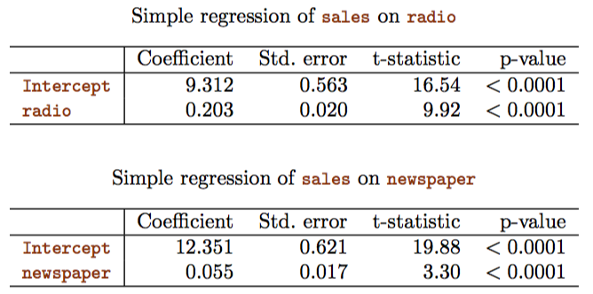
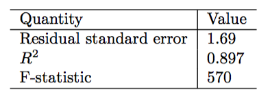

Linear regression is a simple useful tool for predicting a quantitative response. Linear regression is still a useful and widely used statistical learning method. 

Recall the Advertising data as shown below in Figure displays sales (in thousands of units) for a particular product as a function of advertis- ing budgets (in thousands of dollars) for TV, radio, and newspaper media. Suppose that in our role as statistical consultants we are asked to suggest, on the basis of this data, a marketing plan for next year that will result in high product sales. What information would be useful in order to provide such a recommendation? 


There are few important questions that we might seek to address:

* Is there a relationship between advertising budget and sales?  
* How strong is the relationship between advertising budget and sales?  
* Which media contribute to sales?  
* How accurately can we estimate the effect of each medium on sales?  
* How accurately can we predict future sales?  
* Is the relationship linear?  
* Is there synergy among the advertising media?  

# Simple linear regression  
Simple linear regression is a very straightforward approach for predicting a quantitative response $Y$ on the basis of a single predictor variable $X$. The relationship can be written as: $$Y \approx \beta_0 + \beta_1X$$

In this advertising example, $Y$ represent sales and $X$ represents TV or radio or newspaper advertising. Mathematically the equation can be written as: $$sales \approx \beta_0 + \beta_1 \times TV$$

where $\beta_0$ is intercept and $\beta_1$ is slope. These $\beta_0$ and $\beta_1$ are unknown constants these are known as model _coefficients_ or _parameters_.

When training data is used to estimate $\beta_0$ and $\beta_1$ and to predict future sales $Y$ then a hat symbol is used to denote the estimated value for an unknown parameter or coefficient, or to denote the predicted value of the response. The equation can be written as: $$y = \hat \beta_0 + \hat \beta_1x$$

## Estimating the coefficients
In practice $\beta_0$ and $\beta_1$ are unknown. Our goal is to estimate $\hat\beta_0$ and $\hat\beta_1$. Mathematically the equation can be written as $y_i \approx \beta_0 + \beta_1x_i$ for $i = 1,...,n$. In the Advertising example, $x$ could be TV, radio or newspaper; $y$ is sales and $n$ could be different markets. In order to find coefficient estimates as close to actual coefficients, the most common approach is _least squares_.


The prediction of Y on X based on the ith value can be written as: $\hat y_i = \hat \beta_0 + \hat \beta_1x_i$ where $i = 1,...,n$ data points. The difference between the observed response and estimated response can be written as: $e_i = y_i - \hat y_i$. The sum of all errors for all data points can be written as: $$RSS = e_1^2+e_2^2+...+e_n^2$$

The _least squares coefficient estimates_ for simple linear regression can be calculated as: 
$$\hat \beta_0 = \bar y - \hat \beta_1 \bar x$$ 
$$\hat \beta_1 = \frac{\sum_{i=1}^n(x_i - \bar x)(y_i - \bar y)}{\sum_{i=1}^n(x_i - \bar x)^2}$$

where $\bar y\equiv \frac{1}{n} \sum_{i=1}^n y_i$ and $\bar x \equiv \frac{1}{n} \sum_{i=1}^n x_i$ are the sample means. $\equiv$ means _as defined as_ or _by definition_.

Based on the above figure, $\hat \beta_0 = 7.03$ which is intercept. This means that when advertising is 0, the number of units sold is around 7000. $\hat \beta_1 = 0.0475$ is called slope and this means that every $1000 spent on TV advertising, the product sale is around 47.5 additional units.  

## Accessing the accuracy of the coefficient estimates  

The true relationship between $X$ and $Y$ is $$Y = f(X) + \epsilon$$ where $f$ is an unknown function and $\epsilon$ is a mean-zero random error term. If we assume that $f$ is linear then the equation becomes: $$Y=\beta_0 + \beta_1X + \epsilon$$

Here $\beta_0$ is the intercept term that is, the expected value of Y when X = 0, and $\beta_1$ is the slope, the average increase in $Y$ associated with a one-unit increase in $X$.

Note that the true relationship probably may not linear and there may be other variables that cause variation in Y, and there may be measurement errors. That is why an error term is introduced in the equation $Y=\beta_0 + \beta_1X + \epsilon$ which is independent of $X$.

The equation $Y=\beta_0 + \beta_1X + \epsilon$ gives the _population regression line_ which is the best linear approximation to the true relationship between $X$ and $Y$. This is also called _true population regression line_.

The _least squares line_ which is defined as $\hat y = \hat \beta_0 + \hat \beta_1x$ gives close estimation to the _population regression line_.

Based on the figure shown below, 100 random $X$s and corresponding 100 $Y$s are generated from the model $Y = 2+3X+\epsilon$ where $\epsilon$ was generated from a normal distribution with mean zero. The red line shows the true relationship with no error $f(X)=2+3X$, while the blue line is the least squares estimate based on the observed data. In real applications, we have access to a set of observations from which we can compute the least square line but the true population regression line is unobserved. In other words, the true relationship for real data is generally not known. In the right-hand panel of the Figure shown above we have generated ten different data sets from the model given by $Y = 2+3X+\epsilon$ and plotted the corresponding ten least squares lines. Notice that different data sets generated from the same true model result in slightly different least squares lines, but the unobserved population regression line does not change.

![Figure: A simulated data set. Left: The red line represents the true relationship, $f(X)=2+3X$, which is known as the population regression line. The blue line is the least squares line; it is the least squares estimate for $f(X)$ based on the observed data, shown in black. Right: The population regression line is again shown in red, and the least squares line in dark blue. In light blue, ten least squares lines are shown, each computed on the basis of a separate random set of observations. Each least squares line is different, but on average, the least squares lines are quite close to the population regression line.](3-3.png)

With one dataset, why there are two lines and why these are different? This is because the red line represents the entire data set (population) and the blue line represents the part of the data set (sample). Suppose we want to know mean height of every male and female on this planet between the age of 20-30. This is called _population mean_ which is represented by $\mu$. However it is not possible to know the height ($Y$) of every single male and female but we can always estimate mean height ($Y$) based on the available number of males and females ($n$ observations). A reasonable estimate to population mean $\mu$ can be written as $\hat \mu = \bar y$ where $$\bar y = \frac {1}{n}{\sum_{i=1}^n y_i}$$ is the sample mean. In a nutshell, population mean is represented by $\mu$ and sample mean is represented by $\hat \mu$.

If we use sample mean to estimate $\hat \mu$, this estimate is _unbiased_ which means that on average we expect $\hat \mu$ to equal $\mu$.  

__What unbiased means?__ It means that when small number of observations (samples) are used to estimate population mean then $\hat \mu$ might underestimate or overestimate $\mu$. But if we use a huge number of observations (samples) then $\hat \mu$ would exactly equal $\mu$. 

The property of unbiasedness holds for the least squares coefficient estimates as well: if we estimate $\beta_0$ and $\beta_1$ on the basis of a particular data set, then our estimates won’t be exactly equal to $\beta_0$ and $\beta_1$. But if we could average the estimates obtained over a huge number of data sets, then the average of these estimates would be spot on! In fact, we can see from the right hand panel of the Figure shown above that the average of many least squares lines, each estimated from a separate data set, is pretty close to the true population regression line.  

__How accurate is the sample mean $\hat \mu$ as an estimate of $\mu$?__ The answer lies in computing the _standard error of $\hat \mu$, written as SE$(\hat \mu)$. The formula of SE is: $$Var(\hat \mu)=SE(\hat \mu)^2=\frac{\sigma^2}{n}$$ where $\sigma$ is the standard deviation. SE tells the average amount that the estimate $\hat \mu$ differs from the actual value of $\mu$. Similarly we can calculate how close $\hat \beta_0$ and $\hat \beta_1$ are to the true values $\beta_0$ and $\beta_1$. SE of $\hat \beta_0$ and $\hat \beta_1$ can be written as: $$SE(\hat\beta_0)^2 = \sigma^2\Big[\frac{1}{n}+\frac{\bar x^2}{\sum_{i=1}^n(x_i-\bar x^2)}\Big]$$ $$SE(\hat\beta_1)^2 = \sigma^2\Big[\frac{\bar \sigma^2}{\sum_{i=1}^n(x_i-\bar x)^2}\Big]$$

where $\sigma^2 = Var(\epsilon)$. Generally $\sigma^2$ is not known but can be estimated from the data set. The estimation of $\sigma$ is known as the _residual standard error_ and the formula is $$RSE = \sqrt{\dfrac{RSS}{n-2}}$$

### Confidence interval

Standard errors can be used to calculate _confidence intervals_. CI can be defined as "range of values such that with 95% probability, the range will contain the true unknown value of the parameter". CI is defined in terms of lower and upper limits computed from the sample data. In other words, CI tells you how confident you can be that the results from a poll or survey reflect what you would expect to find if it were possible to survey the entire population.

> __95% confidence interval explained__  
The terms _confidence level_ and _confidence interval_ are often confused. A 95% confidence level means is that if the survey or experiment were repeated, 95 percent of the time the data would match the results from the entire population. Sometimes you just can’t survey everyone because of time or cost (think about how much it would cost to do a telephone survey of over 300 million Americans!). Therefore, you take a sample of the population. Having a 95% confidence level means that you’re almost certain your results are the same as if you had surveyed everyone.  
A 95% _confidence interval_ gives you a very specific set of numbers for your confidence level. For example, let’s suppose you were surveying a local school to see what the student’s state test scores are. You set a 95% confidence level and find that the 95% confidence interval is (780,900). That means if you repeated this over and over, 95 percent of the time the scores would fall somewhere between 780 and 900.


Above text is taken from http://www.statisticshowto.com/probability-and-statistics/confidence-interval/ on Nov 27 2017.

***

For linear regression, the 95% confidence interval for $\beta_0$ is $\hat \beta_0 \pm 2 \times SE(\hat \beta_1)$ and for $\beta_1$ is $\hat \beta_1 \pm 2 \times SE(\hat \beta_1)$

The constant (also called z-value) which is 2 (see equation above) at 95% confidence interval is rounded off. The z-value for different confidence intervals are pre-calculated and are shown in the table below.

Confidence level  |     z
---------------   |   -----
0.70              |   1.04
0.75              |   1.15
0.80              |   1.28
0.85              |   1.44
0.90              |   1.645
0.92              |   1.75
0.95              |   1.96
0.96              |   2.05
0.98              |   2.33
0.99              |   2.58

The 95% confidence interval for the advertising data for $\beta_0$ is [6.130,7.935] and $\beta_1$ is [0.042,0.053]. The $\beta_0$ is an intercept which means that when X=0 (with no advertising), the sales on average will fall somewhere between 6,130 and 7,930 units. Remember that the y-axis unit is in thousands. In terms of $\beta_1$, for each $1,000 increase in TV advertising, there will be an average increase in sales of between 42 and 53 units. Remember the unit of x-axis is in thousands.

Calculating 95% confidence interval based on the equation: $\beta_0$ is $\hat \beta_0 \pm 2 \times SE(\hat \beta_1)$ and for $\beta_1$ is $\hat \beta_1 \pm 2 \times SE(\hat \beta_1)$

Based on the table below, we know $\hat \beta_0$, $\hat \beta_1$ and standard errors:

According to the above equations:  
$\beta_0 = 7.0325 \pm 2 \times 0.4578$ gives [6.1169, 7.9481]  
$\beta_1 = 0.0475 \pm 2 \times 0.0027$ gives [0.0421, 0.0529]  


### Hypothesis test
Standard errors can be used to perform hypothesis test on the coefficients. The most common hypothesis test are _null hypothesis_ and _alternative hypothesis_. Null hypothesis can be defined as $H_0$ which means no relationship between X and Y and alternative hypothesis $H_a$ which means there is some relationship between X and Y. In hypothesis test only coefficient $\beta_1$ is tested and if $\beta_1 = 0$ then null hypothesis ($H_0$) is confirmed and if $\beta_1 \ne 0$ then alternative hypothesis ($H_a$) is confirmed. In linear regression when $\beta_1$ becomes zero then the equation has only $Y=\beta_0 + \epsilon$

To test the null hypothesis, we need to determine whether $\hat \beta_1$, our estimate for $\beta_1$, is sufficiently far from zero that we can be confident that $\beta_1$ is non-zero. How far is far enough? This of course depends on the accuracy of $\hat\beta_1$ that is, it depends on SE($\hat \beta_1$). If SE($\hat \beta_1$) is small, then even relatively small values of $\hat \beta_1$ may provide strong evidence that $\beta_1 \ne 0$, and hence that there is a relationship between X and Y . In contrast, if SE($\hat\beta_1$) is large, then $\hat\beta_1$ must be large in absolute value in order for us to reject the null hypothesis.

In practice we compute _t-statistic_ given by $$t = \frac{\hat\beta_1-0}{SE(\hat\beta_1)}$$ which measures the number of standard deviations that $\hat \beta_1$ is away from zero. If there really is no relationship between X and Y , then we expect that the above equation will have a t-distribution with n − 2 degrees of freedom. 

The probability of p-value can be interpret as: a small p-value indicates that it is unlikely to observe such a substantial association between the predictor and the response due to chance, in the absence of any real association between the predictor and the response. In other words, small p-value means that we can infer that there is an association between the predictor and the response and thus reject the _null hypothesis_. Typical p-value cutoffs for rejecting the null hypothesis are 5 or 1 %. When n = 30, these correspond to t-statistics of around 2 and 2.75, respectively (see above table).

The above tables provides details of the least squares model for the regression of number of units sold on TV advertising budget for the Advertising data. Notice that the coefficients for $\hat \beta_0$ and $\hat \beta_1$ are very large relative to their standard errors, so the t-statistics are also large; the probabilities of seeing such values if $H_0$ is true are virtually zero. Hence we can conclude that $\beta_0 \ne 0$ and $\beta_1 \ne 0$.

__In a nutshell the following can be concluded:__  

* When $\beta_0 \ne 0$ and $\beta_1 \ne 0$: There is a relationship between X & Y.   
* When $\beta_0 = 0$ and $\beta_1 \ne 0$: If the intercept is zero (no intercept), the resulting model implies that the response must be exactly zero when all the predictors are set to zero.  
* When $\beta_0 \ne 0$ and $\beta_1 = 0$: There is no relationship between X & Y.  

## Accessing the accuracy of the model
Now we have rejected null hypothesis and in favor of the alternative hypothesis, now we want to quantify the extent to which the model fits the data. In other words we want to know how accurate the model is. The quality of linear regression fit is typically assessed using two related quantities: __residual standard error (RSE)__ and the __$R^2$__ statistic.

Quantity                  |   Value
------------------------  |   -----
Residual standard error   |   3.26
$R^2$                     |   0.612
F-statistic               |   312.1  

Table -> For the Advertising data, more information about the least squares model for the regression of number of units sold on TV advertising budget.

###Residual standard error  
The __RSE__ is an estimate of the standard deviation of $\epsilon$. In other words, it is the average amount that the response will deviate from the true regression line. 

The RSE is defined as: $$RSE = \sqrt{\dfrac{1}{n-2} RSS}$$ and RSS is defined as $$RSS = \sum_{i=1}^n(y_i-\hat y_i)^2$$

So RSE finally becomes $$RSE = \sqrt{\dfrac{1}{n-2}\sum_{i=1}^n(y_i-\hat y_i)^2}$$ 

Based on the table above, the RSE is 3.26. This means that even if the model were correct and the true values of the unknown coefficients $\beta_0$ and $\beta_1$ were known exactly, any prediction of sales on the basis of TV advertising would still be off by about 3,260 units on average. Of course, whether or not 3,260 units is an acceptable prediction error depends on the problem context. In the advertising data set, the mean value of sales over all markets is approximately 14,000 units, and so the percentage error is 3,260/14,000 = 23%.

If the predictions obtained using the model are very close to the true outcome which is $\hat y_i \approx y_i$ for $i$ = 1,...,$n$ then the RSE will be small and we can conclude that the model fits the data very well. On the other hand, if $\hat y_i$ is very far from  $y_i$ for one or more observations, then the RSE may be large which indicates that the model does not fit very well.

###$R^2$ statistic
The RSE provides an absolute measure of lack of fit of the model to the data and it is measured in the units of Y. The $R^2$ statistic provides an alternative measure of fit which is independent of Y and it is in the range between 0 and 1. The $R^2$ statistic is a measure of the linear relationship between X and Y .The value close to 1 is considered as good fit. For example if the value is 0.8 which means that the linear regression model is 80% fit to the data. As compared to RSE, the $R^2$ statistic explains how well the model fit to the data.

The $R^2$ statistic has an interpretational advantage over the RSE, since unlike the RSE, it always lies between 0 and 1. However, it can still be challenging to determine what is a good $R^2$ value, and in general, this will depend on the application. For instance, in certain problems in physics, we may know that the data truly comes from a linear model with a small residual error. In this case, we would expect to see an $R^2$ value that is extremely close to 1, and a substantially smaller $R^2$ value might indicate a serious problem with the experiment in which the data were generated. On the other hand, in typical applications in biology, psychology, marketing, and other domains, the linear model is at best an extremely rough approximation to the data, and residual errors due to other unmeasured factors are often very large. In this setting, we would expect only a very small proportion of the variance in the response to be explained by the predictor, and an $R^2$ value well below 0.1 might be more realistic!

## Reproducing linear regression results

```{r,cache=TRUE}
ad = read.csv('~/Desktop/isl/Data sets/Advertising.csv')
attach(ad)
lr = lm(sales~TV,data=ad)
summary(lr)
confint(lr) #confidence interval is set at default 95%
```
From the above results, $\beta_0$ (intercept) is 7.03, $\beta_1$ (slope) is 0.04, $RSE$ is 3.25, $R^2$ is 0.611, p-value is close to 0. The confidence interval at 95% is for the intercept is (6.12 and 7.93) and for the slope is (0.042 and 0.052). The interpretation of these results have already been discussed above.

# Multiple linear regression
In multiple linear regression there are more than one predictor. For example in the Advertising data, there are three predictors such as TV, radio and newspaper. We could simply run linear regression equation for each predictor and understand how each predictor responds to sales. Looking into the table below, increase in radio advertising budget by \$1000, an average increase in sales by 203 units. Similarly increase in newspaper advertising budget by \$1000, an average increase in sales by 55 units. 



__Problem with linear regression__  
If three separate linear regression equations are used to predict response (as mentioned above), the results may be misleading. For example, each of the three regression equations ignores the other two media in forming estimates for the regression coefficients. If the media budgets are correlated with each other in the 200 markets that constitute our data set, then this can lead to very misleading estimates of the individual media effects on sales. A better approach to incorporate multiple predictors. The multiple regression equation for $p$ distinct predictors can be written as:
$$ Y = \beta_0+\beta_1X_1+\beta_2X_2+...+\beta_pX_p+\epsilon$$
where $X_j$ represents the $j$th predictor and $\beta_j$ quantifies the association between that variable and the response. Based on the advertising data the equation can be written as:
$$ sales = \beta_0 + \beta_1TV + \beta_2radio + \beta_3newspaper + \epsilon $$ where regression coefficients $\beta_0, \beta_1,...,\beta_p$ are unknown and must be estimated. One of the approaches to estimate coefficients is least squares approach (as we did in the linear regression). Predicting response using the estimated coefficients can be written as: 
$$\hat y = \hat\beta_0 + \hat\beta_1x_1 + \hat\beta_2x_2+...+\hat\beta_px_p$$

These coefficients can be calculated in R.

Table below displays the multiple regression coefficient estimates when TV, radio, and newspaper advertising budgets are used to predict product sales using the Advertising data. As compared to coefficient estimate of multiple linear regression with coefficient estimate of linear regression, there is a significant difference in the coefficients of TV, radio and newspaper. For \$1,000 increase in budget for TV advertising, the average sale is about 47.5 units (linear regression) and 46 units (multiple regression); for the same increase in budget for radio advertising, the average sale is about 203 units (linear regression) and 189 units (multiple regression). However by increasing \$1,000 in newspaper advertising budget, the average increased on sale is about 55 units under simple linear regression. On the contrary, multiple linear regression shows that there is no relationship between sales and newspaper. In addition, the corresponding newspaper coefficient is close to zero and so t-statistic and a higher p-value of 0.85.


__Coorelation matrix__

##Relationship between the response and predictors  
In order the determine whether there is a relationship between the response and the predictors, null hypothesis can be used (similar to linear regression). The null hypothesis $H_0$ of multiple regression equation is: $$H_0: \beta_1 = \beta_2 = ... = \beta_p = 0$$ 

In other words all the coefficients corresponds to the predictor should be zero in order to confirm null hypothesis. On the contrary, the alternative hypothesis $H_a$ says that atleast one coefficient is non-zero.

###F-statistic
The hypothesis test on multiple regression is done using _F-statistic_ and _t-statistic_ is used to confirm hypothesis test on linear regression. When _F-statistic_ is close to 1 then we can conclude that $H_0$ is true (i.e. no relationship between the response and the predictors). When _F-statistic_ is greater than 1 then we can conclude that $H_a$ is true (i.e. atleast one predictor has a relationship with the response).



The F-statistic of 570 from the table above shows that there is a strong relationship that atleast one of the advertising media is related to sales. Since this is far greater than 1, it provides compelling evidence that at least one of the advertising media must be related to sales. The question is how far should _F-statistic_ from 1 to reject null hypothesis OR similarly close to 1 to accept null hypothesis; where null hypothesis is defined as _no relationship between the response and the predictors_. The answer lies on the number of samples (observations) _n_ and predictors _p_.

* When _n_ is large, a F-statistic that is just a little larger than 1 might still provide evidence against $H_0$. 
* When _n_ is small, a larger F-statistic is needed to reject $H_0$. 

Diagram goes here

####_p-value_ & F-statistic
If _p-values_ are available for each individual predictors and if any one _p-values_ is small then it can be concluded that at least one of the predictors is related to the response. However this conclusion is incorrect when the number of predictors _p_ is large. When _p_ is large, for example _p_ = 100. Lets say that if a _p_ value associated with one variable is below 0.05, we may probably think that there is a relationship between the predictor and the response and we may incorrectly reject $H_0$. However F-statistic does not suffer from this problem and omits the single variable from the model and adjust the number of predictors.

###Limitation of F-statistic
The approach of using an F-statistic to test for any association between the predictors and the response works when p is relatively small, and certainly small compared to n. However, sometimes we have a very large number of variables. If p > n then there are more coefficients to estimate than observations from which to estimate them. In this case we cannot even fit the multiple linear regression model using least squares, so the F-statistic cannot be used. When p is large, some of the approaches discussed in the next section, such as forward selection, can be used.

Need to write about F-statistic from external website

##Which predictors are related to the response
When number of predictors are large, it is possible that all the predictors are associated with response however the question is how much association is contributed significantly towards the response. Often times, the response is only related to a subset of the predictors. The task of determining which predictors are associated with the response, in order to fit a single model involving only those predictors, is referred to as _variable selection._ Lets say if _p_=2 then the total number of model combination is 4 ($2^2=4$). This means that the single best model will be selected out of 4 models. The combination will be:

Predictor $X_1$   |   Predictor $X_2$
---------------   |   -------------
No predictor      |   No predictor 
Predictor $X_1$   |   No predictor
No predictor      |   Predictor $X_2$
Predictor $X_1$   |   Predictor $X_2$

One way of finding the best model is plot all the models and compare them. However this approach is vigorous and is not feasible when p is large. With large number of predictors, there are three approaches to handle such problem:

###Forward selection
A model begins with no variables but just an intercept. In the first step we add variable one at a time to the null model and select the variable which gives the lowest RSS. In the second step, we add variable one at a time to the one-variable model and pick the lowest RSS. This approach continues until some stopping rule is defined.

###Backward selection
In backward selection, start with all variables in the model and remove the variable with the largest p-value, the variable that is the least statistically significant. In the second step, remove the variable from the model which gives the largest p-value. For instance, we may stop when all remaining variables have a p-value below some threshold. Backward selection cannot be used if p > n.

###Mixed selection
This is a combination of forward and backward selection. We start with no variables in the model, and as with forward selection, we add the variable that provides the best fit. We continue to add variables one-by-one. The p-values for variables can become larger as new predictors are added to the model. Hence, if at any point the p-value for one of the variables in the model rises above a certain threshold, then we remove that variable from the model. We continue to perform these forward and backward steps until all variables in the model have a sufficiently low p-value, and all variables outside the model would have a large p-value if added to the model.

##Model fit
The two most common numerical measures of model fit are the RSE and $R^2$. These two terms already discussed in Linear Regression. An $R^2$ value close to 1 indicates the fitness of the selected model.

Predictors            |   $R^2$     |   RSE
----------            |   -----     |   ---
TV                    |   0.61      |   3.26
TV and Radio          |   0.8971    |   1.681
TV, Radio & Newspaper |   0.8972    |   1.686

The above table shows that the inclusion of newspaper predictor has no significant improve on the $R^2$ value and this shows that the newspaper predictor is weakly associated with the response. We can further confirm the assosiciation by looking into the _p-value_. The _p-value_ (0.8599) of newspaper predictor confirms the weak relationship between the predictor and the response. It turns out that $R^2$ will always increase when more variables are added to the model, even if those variables are only weakly associated with the response. Inclusion of newspaper predictor does not increase the $R^2$ significantly and hence this predictor can be dropped from the model.

The above table further shows that the RSE increases when newspaper predictor is included from 1.681 to 1.686. On the contrary, $R^2$ slightly increases in presence of the newspaper predictor. In general RSE is defined as: $$RSE = \sqrt{\dfrac{RSS}{n-p-1}}$$

The models with more variables can have higher RSE if the decrease in RSS is small relative to the increase in p.

##Predictions
Once we have fit the multiple regression model, it is straightforward to apply the following equation
$$\hat y=\hat\beta_0+\hat\beta_1x_1+\hat\beta_2x_2+...+\hat\beta_px_p$$
in order to predict the response Y on the basis of a set of values for the predictors $X_1, X_2,..., X_p$. However, there are three sorts of uncertainty associated with this prediction.

1. The coefficient estimates $\hat\beta_0,\hat\beta_1,...,\hat\beta_p$ are estimates for $\beta_0,\beta_1,...,\beta_p$. That is, the least squares plane
$$\hat Y = \hat \beta_0 + \hat \beta_1X_1 + ... + \hat \beta_pX_p$$ is only an estimate for the true population regression plane $$ f(X) = \beta_0 + \beta_1X + ... + \beta_pX_p$$
The inaccuracy in the coefficient estimates is related to the _reducible error_. We can compute a confidence interval in order to determine how close $\hat Y$ will be to $f(X)$.

2. In practice assuming a linear model for $f(X)$ is almost always an approximation of reality, so there is an additional source of potentially reducible error which we call model bias. So when we use a linear model, we are in fact estimating the best linear approximation to the true surface. However, here we will ignore this discrepancy, and operate as if the linear model were correct.  

3. Even if we knew $f(X)$ and even if we knew the true values for $\beta_0$, $\beta_1$,...,$\beta_p$—the response value cannot be predicted perfectly because of the random error $\epsilon$ in the model which is called _irreducible error_. How much will Y vary from $\hat Y$? We use prediction intervals to answer this question. Prediction intervals are always wider than confidence intervals, because they incorporate both the error in the estimate for f(X) (the reducible error) and the uncertainty as to how much an individual point will differ from the population regression plane (the irreducible error).

We use a confidence interval to quantify the uncertainty surrounding the average sales over a large number of cities. For example, given that \$100,000 is spent on TV advertising and \$20,000 is spent on radio advertising in each city, the 95% confidence interval is [10,985, 11,528]. We interpret this to mean that 95% of intervals of this form will contain the true value of $f(X)$. On the other hand, a prediction interval can be used to quantify the uncertainty surrounding sales for a particular city. Given that \$100,000 is spent on TV advertising and \$20,000 is spent on radio advertising in that city the 95% prediction interval is [7,930, 14,580]. We interpret this to mean that 95% of intervals of this form will contain the true value of $Y$ for this city. Note that both intervals are centered at 11,256, but that the prediction interval is substantially wider than the confidence interval, reflecting the increased uncertainty about sales for a given city in comparison to the average sales over many locations.

> The prediction interval is always wider than the confidence interval due to added uncertanities such as reducible and irreducible errors. The PI involved in predicting a single response whereas CI is used when the response is average.

__How prediction intervals are calculated??__

# Other considerations in the regression model

## Qualitative predictors  

## Extensions of the linear model
The standard linear regression model have two highly restrictive assumptions, i.e the relationship between the predictors and response are _additive_ and _linear_.

### Remove the additive assumption
In our previous analysis of the Advertising data, we concluded that both TV and radio seem to be associated with sales. The linear models that formed the basis for this conclusion assumed that the effect on sales of increasing one advertising medium is independent of the amount spent on the other media. For example, the linear model states that the average effect on sales of a one-unit increase in TV is always $\beta_1$, regardless of the amount spent on radio.

However, this simple model may be incorrect. Suppose that spending money on radio advertising actually increases the effectiveness of TV advertising, so that the slope term for TV should increase as radio increases. In this situation, given a fixed budget of $100,000, spending half on radio and half on TV may increase sales more than allocating the entire amount to either TV or to radio. In marketing, this is known as a __synergy__ effect, and in statistics it is referred to as an __interaction__ effect. Considered the standard multiple regression model with two variables:
$$ Y = \beta_0 + \beta_1X_1 + \beta_2X_2 + \epsilon$$
According to this model, if we increase $X_1$ by one unit, then $Y$ will increase by an average of $\beta_1$ units. Notice that the presence of $X_2$ does not alter this statement that is, regardless of the value of $X_2$, a one-unit increase in $X_1$ will lead to a $\beta_1$ unit increase in $Y$ . One way of extending this model to allow for interaction effects is to include a third predictor, called an __interaction term__, which is constructed by computing the product of $X_1$ and $X_2$. The equation becomes:

$$ Y = \beta_0 + \beta_1X_1 + \beta_2X_2 + \beta_3X_1X_2 + \epsilon$$

```{r}
attach(ad)
t1 = lm(sales~TV+radio+(TV*radio))
t2 = lm(sales~TV+radio)
summary(t1) #with interaction
summary(t2) #without interaction
```

The model that includes the interaction term is superior to the model that contains only main effects. The __main effect__ is defined as the model which has no interaction term. The $R^2$ for the model with no interaction term is 0.89 and with interaction term is 0.96.

In this example, the p-values associated with TV, radio, and the interaction term all are statistically significant, and so it is obvious that all three variables should be included in the model. However, it is sometimes the case that an interaction term has a very small p-value, but the associated main effects (in this case, TV and radio) do not. The __hierarchical principle__ states that __if we include an interaction in a model, we should also include the main effects, even if the p-values associated with their coefficients are not significant__. In other words, if the interaction between $X_1$ and $X_2$ seems important, then we should include both $X_1$ and $X_2$ in the model even if their coefficient estimates have large p-values. The rationale for this principle is that if $X_1 × X_2$ is related to the response, then whether or not the coefficients of $X_1$ or $X_2$ are exactly zero is of little interest. Also $X_1 × X_2$ is typically correlated with $X_1$ and $X_2$, and so leaving them out tends to alter the meaning of the interaction.

### Non-linear relationships
Linear regression model assumes that the relationship between the response and predictors are linear. What about if the relationship is non-linear. Linear regression model can be extended to incorporate non-linearity in the data by using _polynomial regression_.


The above figure shows that the relationship between mpg and horsepower is non-linear and the polynomial regression can be used to model the non-linearity in the dataset.
$$mpg = \beta_0 + \beta_1 horsepower + \beta_2 horsepower^2 + \epsilon$$
The above is a quadratic equation and the result in the above figure shows that the blue curve has a better fit as compared to the orange fit. How about if we increase the power of horsepower? Are we going to get a better fit? The answer lies in analyzing plot of horsepower with different degrees vs mpg. The below plot shows that the model becomes wiggly when adding polynomials. Furthermore the $R^2$ of the quadratic fit is 0.688 compared to 0.606 for the linear fit. The $R^2$ value of higher degree polynomials does not increase significantly. The result shows that the higher degree polynomials (greater than degree 2) does not fit well to the data and has no benefit in doing so. 

```{r}
library(ISLR)
attach(Auto)
minmax = range(horsepower)
x = seq(minmax[1],minmax[2],len=100)
model1 = lm(mpg~horsepower)
model2 = lm(mpg~poly(horsepower,2))
model4 = lm(mpg~poly(horsepower,4))
model5 = lm(mpg~poly(horsepower,5))
model6 = lm(mpg~poly(horsepower,6))
y_model1 = predict(model1, newdata = data.frame(horsepower=x))
y_model2 = predict(model2, newdata = data.frame(horsepower=x))
y_model4 = predict(model4, newdata = data.frame(horsepower=x))
y_model5 = predict(model5, newdata = data.frame(horsepower=x))
y_model6 = predict(model6, newdata = data.frame(horsepower=x))
plot(horsepower,mpg,pch = 16,col='grey')
lines(x,y_model1,lwd=2)
lines(x,y_model2,col='red',lwd=2)
lines(x,y_model4,col='blue',lwd=2)
lines(x,y_model5,col='green',lwd=2)
lines(x,y_model6,col='orange',lwd=2)
legend('topright',legend=c('Linear','Degree 2','Degree 4','Degree 5','Degree 6'),col=c('black','red','blue','green','orange'),cex=0.8,lty=1,lwd=2)
model = c('Linear','Degree 2','Degree 4','Degree 5','Degree 6')
R_squared = c(summary(model1)$r.squared,summary(model2)$r.squared,summary(model4)$r.squared,summary(model5)$r.squared,summary(model6)$r.squared)
data.frame(model,R_squared)
```


## Potential problems
eiwufbdwuief wef[ wefp]

# Comparison of linear regression with K-nearest neighbors


# Exercises #

__8. This question involves the use of simple linear regression on the Auto data set.__

(a) Use the lm() function to perform a simple linear regression with mpg as the response and horsepower as the predictor. Use the summary() function to print the results.

```{r}
library(ISLR)
attach(Auto)
lmodel = lm(mpg~horsepower)
summary(lmodel)


```

* _Is there a relationship between the predictor and the response?_  
Yes. Based on the null hypothesis $\beta_1$ is not zero.   

* _How strong is the relationship between the predictor and the response?_  
ffdd  

* Is the relationship between the predictor and the response positive or negative?  
Negative  

* What is the predicted mpg associated with a horsepower of 98? What are the associated 95 % confidence and prediction intervals?  

__Difference between confidence interval and prediction interval__

(b) Plot the response and the predictor. Use the abline() function to display the least squares regression line.

```{r}
plot(y=mpg,x=horsepower,pch=20)
abline(lmodel,lwd=3,col='red')
```


* Diagnostic plot
* residuals plot
* rstudent()
* hatvalues()


__11. In this problem we will investigate the t-statistic for the null hypothesis $H_0$ : $\beta = 0$ in simple linear regression without an intercept. To begin, we generate a predictor x and a response y as follows.__

* __set.seed(1)__
* __x=rnorm(100)__
* __y=2*x+rnorm(100)__

(a) Perform a simple linear regression of y onto x, without an intercept. Report the coefficient estimate $\hat beta$, the standard error of this coefficient estimate, and the t-statistic and p-value associated with the null hypothesis $H_0$ : $\beta = 0$. Comment on these results. (You can perform regression without an intercept using the command lm(y∼x+0).)


